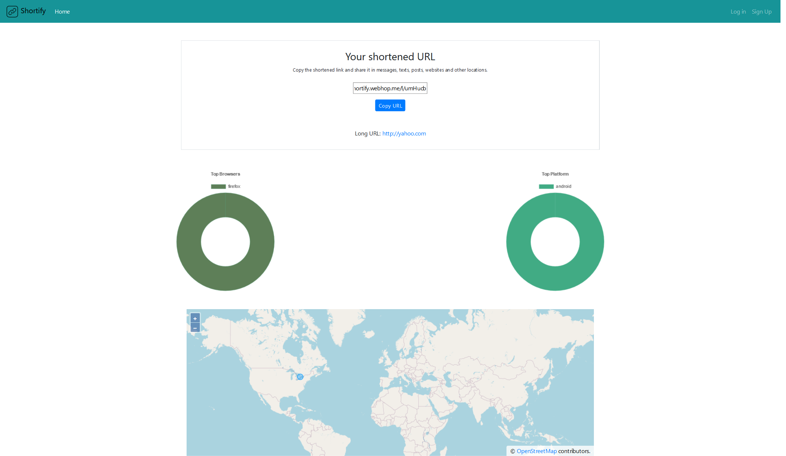

# short_url

A url shortener, implemented common authentication functions of sessions login, password reset via email, account email confirmation on sign up. The app provides a dashboard which shows the clicks’ geolocation, browser, platform statistics and more. Hosted in a docker container on personal Raspberry Pi with dynamic DNS setup and ssl cert configured.

## The stack
- **Server side**: Python, Flask, SQLAlchemy
- **Client side**:  OpenLayers, Chart.js, ES6+ Javascript

## Live App
**View this app [here](https://leoltl-shortify.webhop.me)**

**Sample profiles**

|username|password|
|---|---|
|admin|password|

## Features
**As an unauthenticated user**:
- I can see login page which allows me to put in credentials to login.
- I can create a short url by input in a long url.

**As an authenticated user**:
- I can see a list of short urls I created in the past
- I can view the geolocation and client meta of clicks that generated from my short url
- I can edit and disable a url
